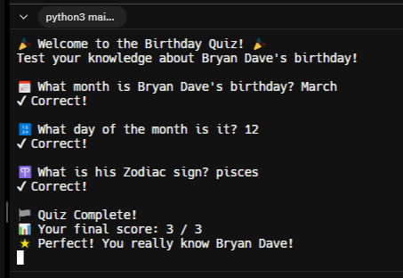

# FP-Project-01-Birthday-Quiz-App

🧁 A simple Python quiz app that asks questions about Bryan Dave's birthday.

## 💡 How it works

- This app asks 3 multiple-choice questions about Bryan Dave's birthday.
- User earns 1 point per correct answer.
- At the end, the total score is shown.

## 📂 Files

- `birthday_quiz.py` → Main program

## 🛠️ How to Run

1. Open any Python IDE (like Replit or VS Code).
2. Copy the code from `birthday_quiz.py`.
3. Run it and answer the questions!

'''bash
python birthday_quiz.py

## Screenshot

